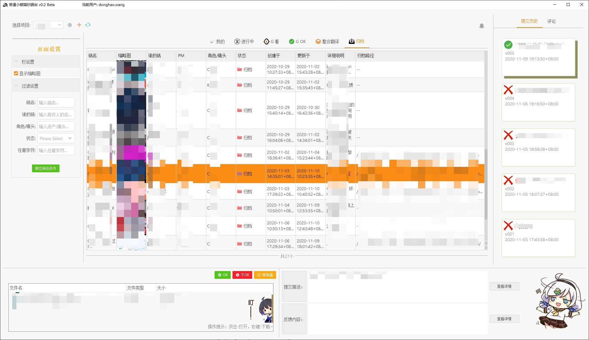
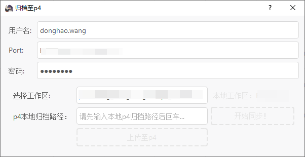
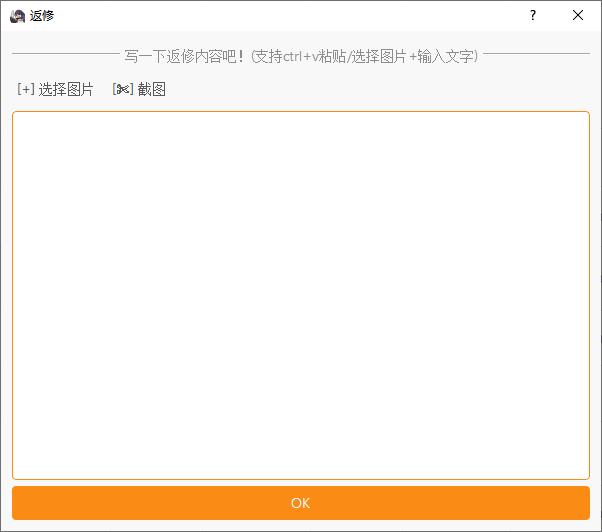

# 内部简易流程管理系统
# Simple Pipeline Management System For Honkai Impact3 Anime team

### 部分功能  
## Create Task // Retake Notes

## 前端依赖
## Front-end dependencies
pyside  
[dayu_widgets](https://github.com/phenom-films/dayu_widgets)  
[阿里矢量图标库](https://www.iconfont.cn/)  

## 后端依赖
## Backend dependencies
数据库：shotgun+postgresql数据缓存 ([这里](http://ddpark.xyz)介绍了pg做缓存地方法)  
p4模块：[p4python](https://www.perforce.com/perforce/r14.2/manuals/p4script/python.programming.html)  
消息系统：[rabbitmq](https://www.rabbitmq.com/)

## 主要功能
+ 基本工作流的实现  
  + 任务创建与接取
  + 提交文件、版本控制
  + 文件目录结构自动创建
  + 审批与反馈、状态自动变更
  + 多人评论
+ 即时消息提醒  
  + 消息第一时间通知
  + 消息盒子用来储存历史消息
+ 和shotgun的信息通信  
+ 和p4的文件系统对接
+ 和DCC软件的对接
## Main Functions
+ Workfolw
  + Creating Task and Assigning
  + Submitting / Version Control
  + Auto QC
  + Retake / Reviewing / Auto status chaging
  + Comments
+ Message 
  + Message pop up instantly
  + Message box for storing history
+ Communicating with Shotgrid
+ Communicating with Perforce(Downloading and Archieving)
+ Communicating with DCC tools.

